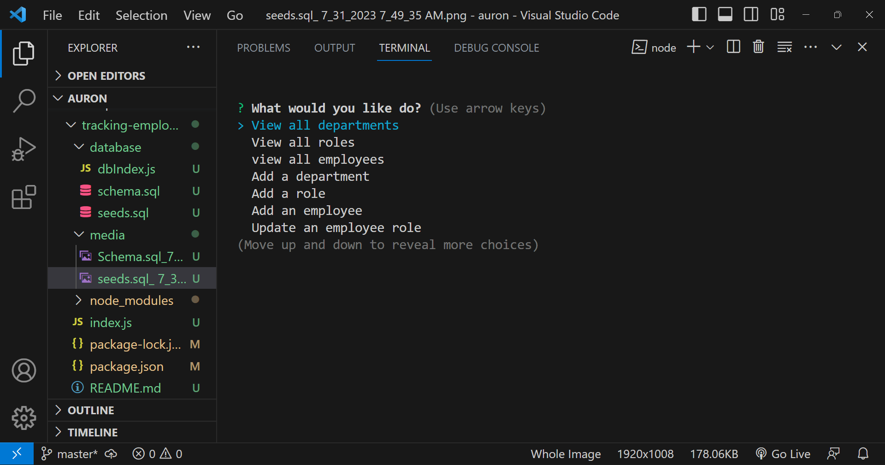
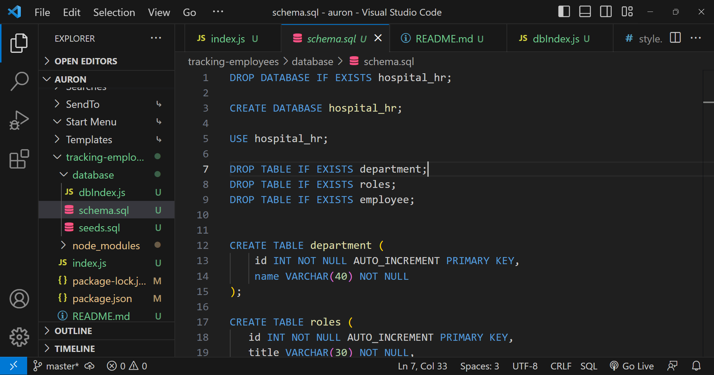
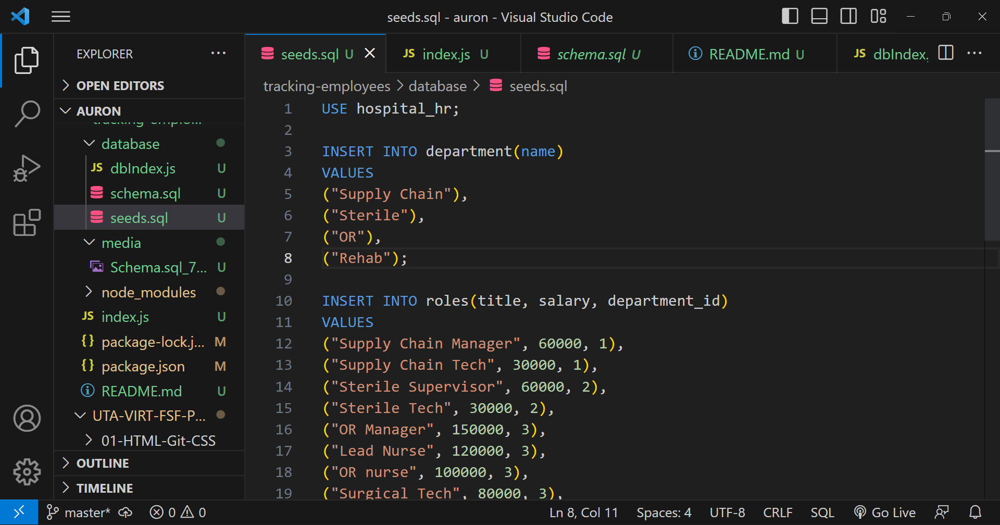

  

# tracking-employees

## Description
App used to track employees using sql and node by terminal commands

## Table of Contents
- [Installation](#Installation)
- [Usage](#Usage)
- [Credits](#Credits)
- [License](#License)
- [Contributors](#Contributing)
- [Tests](#Tests)
- [Questions](#Questions)

## Installation
Please install node.js 
  
## Usage 
This app will allow the user to track departments, roles and employees.

## Credits
I got help from Github user njthanhtrang at ""..

## License 
For more info, please visit: [License Link](https://opensource.org/licenses/MIT)

## Contributing
Feel free to add wonderful features

## Tests 
N/A

## Questions 
If you have any questions you can find me at [SilvAG6271](https://github.com/SilvAG6271) and <a href="mailto:auron7985@gmail.com">auron7985@gmail.com</a>.
